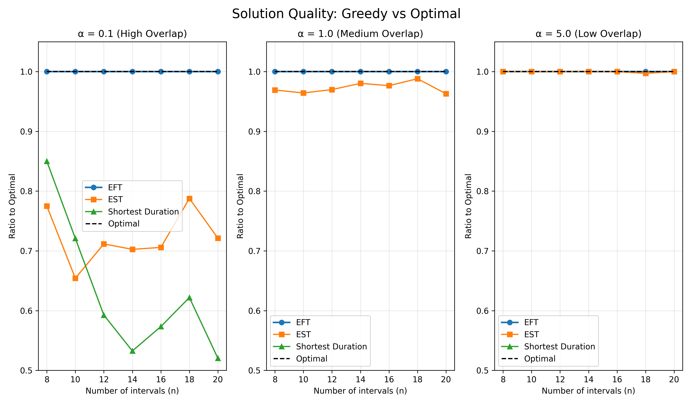
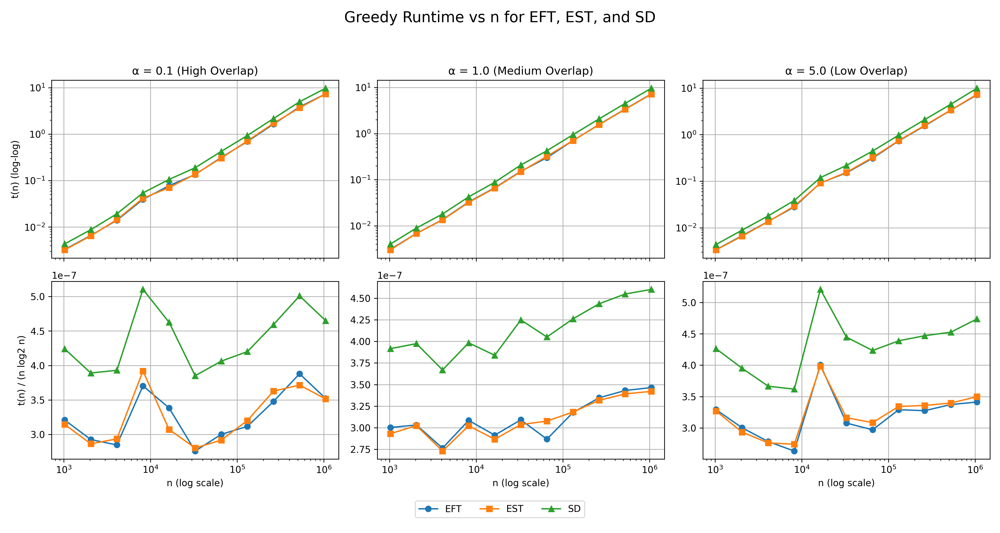
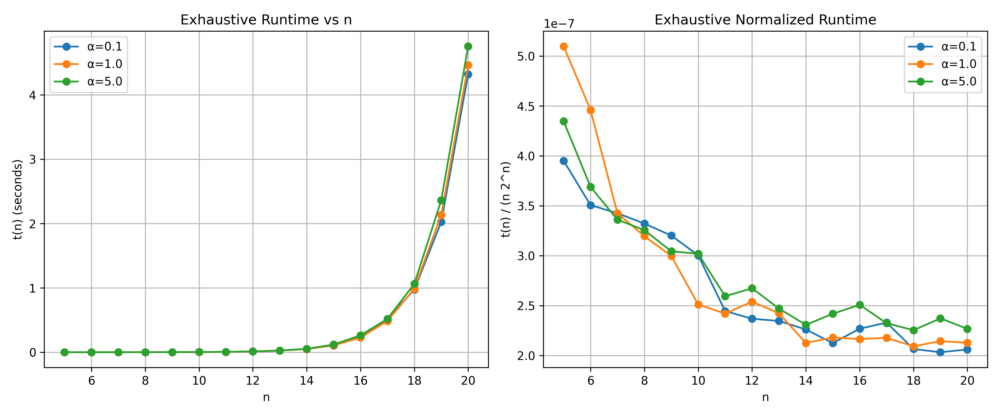

# Empirical Study of Interval Scheduling Algorithms

## 1. Overview of Implementation
The coding task implements and empirically evaluates greedy heuristics and an exhaustive optimal solver for the Interval Scheduling Problem (maximizing non-overlapping intervals). Key components:
- **Dataset Generation**: Random intervals with start ~ Uniform(0, T), duration ~ Uniform(1, 100), where T = α * n * 100. α controls overlap: 0.1 (high), 1.0 (medium), 5.0 (low).
- **Algorithms**:
  - Greedy: EFT (sort by finish, select non-overlapping), EST (sort by start), SD (sort by duration). All use merge sort (O(n log n)).
  - Exhaustive: Enumerates 2^n subsets, validates non-overlap (O(n log n) per subset), finds max size. No pruning, leading to O(n 2^n) worst-case.
- **Experiments**:
  - Quality ratios for small n (n = 4, 6, …, 20). For each (α, n) we perform 1 warmup run (not recorded) and then 20 recorded trials.
  - Greedy runtime for all three greedy algorithms (EFT, EST, SD) with n = 2^10,…,2^20 (1024 up to ≈1M). For each (α, n, algorithm) we perform 1 warmup run and then 10 recorded trials.
  - Exhaustive runtime for n = 5,…,20. For each (α, n) we perform 1 warmup run and then 10 recorded trials.
  For every recorded configuration we report the sample mean and standard deviation.
- **Tools**: Python, NumPy, Matplotlib.

## 2. Solution Quality Analysis
**Coding Question Addressed**: Compare greedy strategies (EFT, EST, SD) against optimal for solution quality (ratio of selected intervals to optimal) across overlap regimes and n values.

Experiments: For n = 4, 6, …, 20 (step 2), 20 recorded trials per point (plus one warmup), we compute the mean and standard deviation of the quality ratio (greedy count / optimal count).

### Key Findings
- **EFT**: Empirically achieves ratio 1.0 (EFT_mean = 1.0 with zero standard deviation) across all α and n, confirming optimality. This aligns with proof by contradiction: assuming an optimal solution has more jobs leads to a contradiction by showing the greedy algorithm's early finish leaves room for additional jobs.
- **EST and SD**: Heuristics that are not always optimal. Performance depends strongly on overlap and on how the ordering interacts with time:
  - High overlap (α=0.1): EST ratios stay around 0.70–0.75 (e.g., 0.732 at n=20), while SD ratios decrease from about 0.98 (n=4) to about 0.55 (n=20). Dense conflicts punish poor choices (e.g., EST may select early-starting long jobs blocking others; SD can still do reasonably well by picking many short jobs that fit between conflicts).
  - Medium overlap (α=1.0): EST remains very close to 1.0 (≈0.95–0.99 across n), whereas SD ratios are significantly lower, roughly 0.26–0.65 and decreasing with n (0.259 at n=20).
  - Low overlap (α=5.0): EST is essentially always optimal (exactly 1.0 for all n in our experiments), but SD performs worst here, with quality dropping from ~0.53 (n=4) to ~0.17 (n=20). With very sparse conflicts, the optimal solution can include almost all intervals, but SD orders jobs purely by duration. This acts like a “random” time ordering: once a very short interval late in time is chosen, many subsequent jobs (which start earlier) are rejected, so SD leaves a lot of free time unused.
- Observation: EFT's finish-time priority is crucial (proven optimal). EST benefits whenever start time is a good proxy for finish time (especially in low-overlap settings). SD has no temporal awareness beyond duration, so its schedule can be much smaller than optimal even when conflicts are rare, highlighting why duration-only greediness is a poor quality heuristic.

### Plot: Solution Quality: Greedy vs Optimal

**Table 1a: Quality Ratios for α = 0.1 (High Overlap)**

| n  | EFT mean | EFT std | EST mean | EST std | SD mean | SD std | Optimal |
|----|----------|---------|----------|---------|---------|--------|---------|
| 4  | 1.000    | 0.000   | 0.950    | 0.154   | 0.975   | 0.112  | 1.0     |
| 6  | 1.000    | 0.000   | 0.833    | 0.236   | 0.900   | 0.205  | 1.0     |
| 8  | 1.000    | 0.000   | 0.767    | 0.262   | 0.808   | 0.255  | 1.0     |
| 10 | 1.000    | 0.000   | 0.713    | 0.267   | 0.725   | 0.225  | 1.0     |
| 12 | 1.000    | 0.000   | 0.745    | 0.244   | 0.672   | 0.201  | 1.0     |
| 14 | 1.000    | 0.000   | 0.698    | 0.207   | 0.606   | 0.255  | 1.0     |
| 16 | 1.000    | 0.000   | 0.743    | 0.182   | 0.611   | 0.198  | 1.0     |
| 18 | 1.000    | 0.000   | 0.663    | 0.156   | 0.583   | 0.170  | 1.0     |
| 20 | 1.000    | 0.000   | 0.732    | 0.153   | 0.547   | 0.166  | 1.0     |

**Table 1b: Quality Ratios for α = 1.0 (Medium Overlap)**

| n  | EFT mean | EFT std | EST mean | EST std | SD mean | SD std | Optimal |
|----|----------|---------|----------|---------|---------|--------|---------|
| 4  | 1.000    | 0.000   | 1.000    | 0.000   | 0.646   | 0.183  | 1.0     |
| 6  | 1.000    | 0.000   | 0.988    | 0.056   | 0.597   | 0.247  | 1.0     |
| 8  | 1.000    | 0.000   | 0.953    | 0.083   | 0.438   | 0.168  | 1.0     |
| 10 | 1.000    | 0.000   | 0.994    | 0.028   | 0.348   | 0.173  | 1.0     |
| 12 | 1.000    | 0.000   | 0.995    | 0.022   | 0.344   | 0.120  | 1.0     |
| 14 | 1.000    | 0.000   | 0.986    | 0.034   | 0.300   | 0.077  | 1.0     |
| 16 | 1.000    | 0.000   | 0.968    | 0.060   | 0.283   | 0.123  | 1.0     |
| 18 | 1.000    | 0.000   | 0.972    | 0.046   | 0.287   | 0.108  | 1.0     |
| 20 | 1.000    | 0.000   | 0.984    | 0.040   | 0.259   | 0.123  | 1.0     |

**Table 1c: Quality Ratios for α = 5.0 (Low Overlap)**

| n  | EFT mean | EFT std | EST mean | EST std | SD mean | SD std | Optimal |
|----|----------|---------|----------|---------|---------|--------|---------|
| 4  | 1.000    | 0.000   | 1.000    | 0.000   | 0.533   | 0.152  | 1.0     |
| 6  | 1.000    | 0.000   | 1.000    | 0.000   | 0.468   | 0.157  | 1.0     |
| 8  | 1.000    | 0.000   | 1.000    | 0.000   | 0.388   | 0.167  | 1.0     |
| 10 | 1.000    | 0.000   | 1.000    | 0.000   | 0.298   | 0.120  | 1.0     |
| 12 | 1.000    | 0.000   | 1.000    | 0.000   | 0.281   | 0.121  | 1.0     |
| 14 | 1.000    | 0.000   | 1.000    | 0.000   | 0.278   | 0.103  | 1.0     |
| 16 | 1.000    | 0.000   | 1.000    | 0.000   | 0.247   | 0.089  | 1.0     |
| 18 | 1.000    | 0.000   | 1.000    | 0.000   | 0.232   | 0.113  | 1.0     |
| 20 | 1.000    | 0.000   | 1.000    | 0.000   | 0.166   | 0.072  | 1.0     |

These results validate that SD has counterexamples (high-overlap case shows failure) and demonstrate the maintained non-overlap loop invariant in the greedy algorithm, proven via induction.

## 3. Runtime Complexity Validation
**Coding Question Addressed**: Empirically validate Big-O complexities for greedy (O(n log n)) and exhaustive (O(2^n)) across α, with normalization to confirm bounds.

### 3.1 Greedy Runtime (EFT, EST, SD)
Experiments: n = 2^10,…,2^20 (1024 up to ≈1M), 10 recorded trials per (α, n, algorithm) after a warmup. For each configuration we measure total time (sorting + selection) and compute both the mean and standard deviation across trials.

- **Findings**:
  - Runtime scales as O(n log n): Log-log plot shows near-linear slope (slope ≈1 for n log n).
  - Normalized t(n)/(n log₂ n): Stabilizes around (2.7–3.3) × 10^{-7} s for α=1.0 (e.g., ≈2.82 × 10^{-7} at n=1024 and ≈3.19 × 10^{-7} at n=524288), confirming the n log n bound. Initial fluctuations are due to overhead at small n.
  - α Impact: All three overlap regimes exhibit very similar growth curves; constants differ slightly but the asymptotic behaviour is the same.
- Ties to Theory: Matches Mergesort's O(n log n) worst-case time complexity and O(n) space.

### Plot: Greedy Runtime Validation

**Table 2a: Greedy Runtime for α = 0.1 (seconds)**

| n      | EFT mean | EFT std | EST mean | EST std | SD mean | SD std |
|--------|----------|---------|----------|---------|---------|--------|
| 1024   | 0.00329  | 0.00018 | 0.00322  | 0.00016 | 0.00434 | 0.00022 |
| 2048   | 0.00659  | 0.00098 | 0.00645  | 0.00067 | 0.00877 | 0.00083 |
| 4096   | 0.01400  | 0.00174 | 0.01443  | 0.00226 | 0.01932 | 0.00289 |
| 8192   | 0.03945  | 0.01131 | 0.04174  | 0.01267 | 0.05434 | 0.01273 |
| 16384  | 0.07764  | 0.01057 | 0.07048  | 0.00565 | 0.10610 | 0.01750 |
| 32768  | 0.13567  | 0.01028 | 0.13783  | 0.00972 | 0.18933 | 0.02037 |
| 65536  | 0.31484  | 0.04142 | 0.30610  | 0.03832 | 0.42602 | 0.04188 |
| 131072 | 0.69460  | 0.04913 | 0.71362  | 0.10140 | 0.93609 | 0.04673 |
| 262144 | 1.64113  | 0.11345 | 1.71204  | 0.42256 | 2.16683 | 0.12229 |
| 524288 | 3.86553  | 0.65289 | 3.70190  | 0.42459 | 4.98860 | 0.54929 |
| 1048576| 7.38585  | 0.46507 | 7.37126  | 0.48515 | 9.75180 | 0.28401 |

**Table 2b: Greedy Runtime for α = 1.0 (seconds)**

| n      | EFT mean | EFT std | EST mean | EST std | SD mean | SD std |
|--------|----------|---------|----------|---------|---------|--------|
| 1024   | 0.00308  | 0.00038 | 0.00300  | 0.00020 | 0.00401 | 0.00033 |
| 2048   | 0.00683  | 0.00068 | 0.00681  | 0.00063 | 0.00895 | 0.00083 |
| 4096   | 0.01358  | 0.00083 | 0.01342  | 0.00045 | 0.01803 | 0.00083 |
| 8192   | 0.03286  | 0.00457 | 0.03219  | 0.00363 | 0.04242 | 0.00402 |
| 16384  | 0.06684  | 0.00795 | 0.06576  | 0.00797 | 0.08806 | 0.01087 |
| 32768  | 0.15196  | 0.01674 | 0.14927  | 0.02070 | 0.20883 | 0.02079 |
| 65536  | 0.30073  | 0.01456 | 0.32267  | 0.01827 | 0.42479 | 0.02366 |
| 131072 | 0.70791  | 0.03715 | 0.70905  | 0.04205 | 0.94962 | 0.07355 |
| 262144 | 1.57915  | 0.05037 | 1.56567  | 0.09355 | 2.09316 | 0.10506 |
| 524288 | 3.41837  | 0.08909 | 3.37917  | 0.09577 | 4.53149 | 0.17309 |
| 1048576| 7.26710  | 0.17949 | 7.17508  | 0.13292 | 9.65195 | 0.25491 |

**Table 2c: Greedy Runtime for α = 5.0 (seconds)**

| n      | EFT mean | EFT std | EST mean | EST std | SD mean | SD std |
|--------|----------|---------|----------|---------|---------|--------|
| 1024   | 0.00337  | 0.00034 | 0.00335  | 0.00033 | 0.00437 | 0.00034 |
| 2048   | 0.00677  | 0.00054 | 0.00661  | 0.00060 | 0.00890 | 0.00056 |
| 4096   | 0.01368  | 0.00070 | 0.01357  | 0.00094 | 0.01802 | 0.00052 |
| 8192   | 0.02803  | 0.00054 | 0.02919  | 0.00152 | 0.03853 | 0.00138 |
| 16384  | 0.09188  | 0.02936 | 0.09138  | 0.03274 | 0.11945 | 0.03516 |
| 32768  | 0.15126  | 0.01848 | 0.15547  | 0.02037 | 0.21856 | 0.03184 |
| 65536  | 0.31149  | 0.01630 | 0.32349  | 0.02399 | 0.44394 | 0.02929 |
| 131072 | 0.73316  | 0.04006 | 0.74473  | 0.03398 | 0.97779 | 0.07434 |
| 262144 | 1.54565  | 0.07639 | 1.58475  | 0.09703 | 2.10928 | 0.09504 |
| 524288 | 3.36016  | 0.12519 | 3.38410  | 0.14685 | 4.50804 | 0.16716 |
| 1048576| 7.15780  | 0.12777 | 7.33548  | 0.23751 | 9.93454 | 0.78990 |

### 3.2 Exhaustive Runtime
Experiments: n = 5,…,20, 10 recorded trials per (α, n) after a warmup. For each configuration we record the mean and standard deviation of the exhaustive solver's runtime.

- **Findings**:
  - Runtime O(n 2^n): vs n plot shows exponential growth (up to roughly 4s at n=20 for high overlap; e.g., ≈3.93 s for α=0.1 and ≈4.85 s for α=5.0).
  - Normalized t(n)/(n 2^n): Decreases to roughly (1.9–3.3) × 10^{-7} s (trends toward a constant but doesn't fully stabilize due to small n). High overlap (α=0.1) has a slightly lower constant (implicit early invalidations act as "pruning").
  - α Impact: High overlap is faster in practice (more early conflicts skip computations), but worst-case remains exponential for all α.
- Ties to Theory: Impractical for n>20 (e.g., n=20: ~1 million subsets, compared to n! for TSP which is ~2.4 × 10^{18} for n=20, far worse). No explicit pruning, but backtracking can significantly reduce runtime for small or typical n by eliminating branches that cannot lead to a better solution, so fewer states are explored in practice. However, in the worst case, no branches are pruned and the algorithm still examines all possible subsets (≈ 2ⁿ states). Therefore, pruning improves average-case performance but does not change the worst-case time complexity, which remains exponential and impractical at scale.

### Plot: Exhaustive Runtime Validation

**Table 3a: Exhaustive Runtime for α = 0.1 (seconds)**

| n  | Time mean | Time std |
|----|-----------|----------|
| 5  | 0.000063  | 0.000001 |
| 6  | 0.000135  | 0.000003 |
| 7  | 0.000307  | 0.000023 |
| 8  | 0.000680  | 0.000053 |
| 9  | 0.001475  | 0.000028 |
| 10 | 0.003076  | 0.000249 |
| 11 | 0.005509  | 0.000581 |
| 12 | 0.011640  | 0.000666 |
| 13 | 0.024988  | 0.002617 |
| 14 | 0.051852  | 0.004704 |
| 15 | 0.104410  | 0.007210 |
| 16 | 0.237861  | 0.017699 |
| 17 | 0.519142  | 0.041080 |
| 18 | 0.974384  | 0.055177 |
| 19 | 2.024950  | 0.091050 |
| 20 | 4.321566  | 0.246645 |

**Table 3b: Exhaustive Runtime for α = 1.0 (seconds)**

| n  | Time mean | Time std |
|----|-----------|----------|
| 5  | 0.000082  | 0.000008 |
| 6  | 0.000171  | 0.000020 |
| 7  | 0.000307  | 0.000020 |
| 8  | 0.000655  | 0.000044 |
| 9  | 0.001381  | 0.000062 |
| 10 | 0.002571  | 0.000149 |
| 11 | 0.005451  | 0.000283 |
| 12 | 0.012480  | 0.001046 |
| 13 | 0.025815  | 0.002144 |
| 14 | 0.048761  | 0.001932 |
| 15 | 0.107179  | 0.011250 |
| 16 | 0.226969  | 0.011118 |
| 17 | 0.485052  | 0.028019 |
| 18 | 0.987315  | 0.053143 |
| 19 | 2.135220  | 0.124462 |
| 20 | 4.461126  | 0.172540 |

**Table 3c: Exhaustive Runtime for α = 5.0 (seconds)**

| n  | Time mean | Time std |
|----|-----------|----------|
| 5  | 0.000070  | 0.000011 |
| 6  | 0.000142  | 0.000014 |
| 7  | 0.000301  | 0.000009 |
| 8  | 0.000667  | 0.000028 |
| 9  | 0.001403  | 0.000056 |
| 10 | 0.003092  | 0.000177 |
| 11 | 0.005843  | 0.000513 |
| 12 | 0.013141  | 0.000466 |
| 13 | 0.026313  | 0.001284 |
| 14 | 0.052912  | 0.003145 |
| 15 | 0.118854  | 0.014092 |
| 16 | 0.262964  | 0.015883 |
| 17 | 0.517882  | 0.021594 |
| 18 | 1.063367  | 0.053830 |
| 19 | 2.363031  | 0.159651 |
| 20 | 4.754809  | 0.237228 |

## 4. Discussion and Observations
- **Overlap Impact (α)**: High overlap amplifies heuristic failures for EST/SD but slightly improves exhaustive runtime (implicit pruning). Medium overlap already shows SD drifting away from optimal, and in low-overlap settings EST becomes essentially optimal while SD degrades sharply because its duration-based ordering ignores where intervals sit in time.
- **Trade-offs**: Greedy efficient (scalable) but heuristics like EST/SD can be suboptimal, distinguishing them from proven algorithms. SD, in particular, is fast but unreliable for quality. Exhaustive is optimal but unscalable (NP-hard problem similar to TSP).
- **Limitations**: Small n for exhaustive limits normalization; floating-point precision in intervals; no pruning in exhaustive.
- **Improvements**: Use dynamic programming for optimal (O(n log n)) in quality tests; integer intervals; more α/trials.
- **Relation to Theory**: Empirical results support theoretical proofs (EFT optimality via contradiction/induction). Failure of heuristics in counterexamples shows why trial-and-error is insufficient.

## 5. Conclusion
The implementation confirms EFT's optimality and O(n log n) efficiency, while heuristics approximate variably based on overlap. Exhaustive validates optimality but highlights exponential impracticality. This empirical study complements theory, demonstrating criteria like correctness, efficiency, and simplicity.

